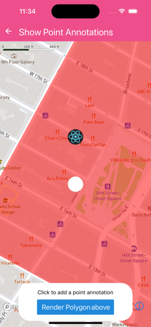

Shows Point annotation with images


```jsx
import React, { useRef, useState } from 'react';
import { View, Text, StyleSheet, Image } from 'react-native';
import {
  Callout,
  Camera,
  FillLayer,
  MapView,
  PointAnnotation,
  ShapeSource,
  getAnnotationsLayerID,
} from '@rnmapbox/maps';
import { Point, Position } from 'geojson';
import { Button } from '@rneui/base';

import Bubble from '../common/Bubble';
import { ExampleWithMetadata } from '../common/ExampleMetadata'; // exclude-from-doc

const ANNOTATION_SIZE = 40;

const styles = {
  annotationContainer: {
    alignItems: 'center',
    backgroundColor: 'white',
    borderColor: 'rgba(0, 0, 0, 0.45)',
    borderRadius: ANNOTATION_SIZE / 2,
    borderWidth: StyleSheet.hairlineWidth,
    height: ANNOTATION_SIZE,
    justifyContent: 'center',
    overflow: 'hidden',
    width: ANNOTATION_SIZE,
  },
  matchParent: {
    flex: 1,
  },
} as const;

type AnnotationWithRemoteImageProps = {
  id: string;
  title: string;
  coordinate: Position;
};

const AnnotationWithRemoteImage = ({
  id,
  coordinate,
  title,
}: AnnotationWithRemoteImageProps) => {
  const pointAnnotation = useRef<PointAnnotation>(null);

  return (
    <PointAnnotation
      id={id}
      coordinate={coordinate}
      title={title}
      draggable
      onSelected={(feature) =>
        console.log('onSelected:', feature.id, feature.geometry.coordinates)
      }
      onDrag={(feature) =>
        console.log('onDrag:', feature.id, feature.geometry.coordinates)
      }
      onDragStart={(feature) =>
        console.log('onDragStart:', feature.id, feature.geometry.coordinates)
      }
      onDragEnd={(feature) =>
        console.log('onDragEnd:', feature.id, feature.geometry.coordinates)
      }
      ref={pointAnnotation}
    >
      <View style={styles.annotationContainer}>
        <Image
          source={{ uri: 'https://reactnative.dev/img/tiny_logo.png' }}
          style={{ width: ANNOTATION_SIZE, height: ANNOTATION_SIZE }}
          onLoad={() => pointAnnotation.current?.refresh()}
          // Prevent rendering bitmap at unknown animation state
          fadeDuration={0}
        />
      </View>
      <Callout title="This is a sample loading a remote image" />
    </PointAnnotation>
  );
};

const ShowPointAnnotation = () => {
  const [coordinates, setCoordinates] = useState([
    [-73.99155, 40.73581],
    [-73.99155, 40.73681],
  ]);
  const [layerRendering, setLayerRendering] = useState<'below' | 'above'>(
    'below',
  );

  const renderAnnotations = () => {
    const items = [];

    for (let i = 0; i < coordinates.length; i++) {
      const coordinate = coordinates[i];

      const title = `Lon: ${coordinate[0]} Lat: ${coordinate[1]}`;
      const id = `pointAnnotation${i}`;

      if (i % 2 === 1) {
        items.push(
          null,
          <AnnotationWithRemoteImage
            key={id}
            id={id}
            coordinate={coordinate}
            title={title}
          />,
        );
      } else {
        items.push(
          null,
          <PointAnnotation
            key={id}
            id={id}
            coordinate={coordinate}
            title={title}
          >
            <View style={styles.annotationContainer} />
            <Callout title="This is an empty example" />
          </PointAnnotation>,
        );
      }
    }

    return items;
  };

  return (
    <>
      <MapView
        onPress={(feature) => {
          setCoordinates((prevState) => [
            ...prevState,
            (feature.geometry as Point).coordinates,
          ]);
        }}
        style={styles.matchParent}
      >
        <Camera
          defaultSettings={{ centerCoordinate: coordinates[0], zoomLevel: 16 }}
        />

        {renderAnnotations()}

        <ShapeSource
          id="polygon"
          shape={{
            coordinates: [
              [
                [-73.98813787946587, 40.73199795542578],
                [-73.98313197853199, 40.7388685230859],
                [-73.98962548210226, 40.74155214586244],
                [-73.9945841575561, 40.73468185536569],
                [-73.98813787946587, 40.73199795542578],
              ],
            ],
            type: 'Polygon',
          }}
        >
          <FillLayer
            id="polygon"
            {...{
              [layerRendering + 'LayerID']:
                getAnnotationsLayerID('PointAnnotations'),
            }}
            style={{
              fillColor: 'rgba(255, 0, 0, 0.5)',
              fillOutlineColor: 'red',
            }}
          />
        </ShapeSource>
      </MapView>

      <Bubble>
        <Text style={{ marginBottom: 10 }}>
          Click to add a point annotation
        </Text>
        <Button
          onPress={() =>
            setLayerRendering(
              (prevState) =>
                (({ above: 'below', below: 'above' } as const)[prevState]),
            )
          }
        >
          Render Polygon {{ above: 'below', below: 'above' }[layerRendering]}
        </Button>
      </Bubble>
    </>
  );
};

export default ShowPointAnnotation;


```

}

