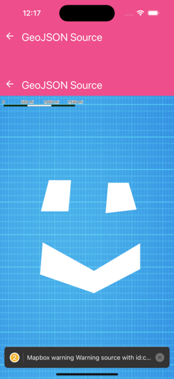

```jsx
import React from 'react';
import MapboxGL from '@rnmapbox/maps';

import sheet from '../../styles/sheet';
import gridPattern from '../../assets/grid_pattern.png';
import smileyFaceGeoJSON from '../../assets/smiley_face.json';
import BaseExamplePropTypes from '../common/BaseExamplePropTypes';
import Page from '../common/Page';

const layerStyles = {
  background: {
    backgroundPattern: gridPattern,
  },
  smileyFace: {
    fillAntialias: true,
    fillColor: 'white',
    fillOutlineColor: 'rgba(255, 255, 255, 0.84)',
  },
};

class GeoJSONSource extends React.Component {
  static propTypes = {
    ...BaseExamplePropTypes,
  };

  render() {
    return (
      <Page {...this.props}>
        <MapboxGL.MapView
          ref={(ref) => (this.map = ref)}
          style={sheet.matchParent}
          styleURL={MapboxGL.StyleURL.Dark}
        >
          <MapboxGL.Camera
            zoomLevel={2}
            centerCoordinate={[-35.15165038, 40.6235728]}
          />

          <MapboxGL.VectorSource>
            <MapboxGL.BackgroundLayer
              id="background"
              style={layerStyles.background}
            />
          </MapboxGL.VectorSource>

          <MapboxGL.ShapeSource id="smileyFaceSource" shape={smileyFaceGeoJSON}>
            <MapboxGL.FillLayer
              id="smileyFaceFill"
              style={layerStyles.smileyFace}
            />
          </MapboxGL.ShapeSource>
        </MapboxGL.MapView>
      </Page>
    );
  }
}

export default GeoJSONSource;


```

}

