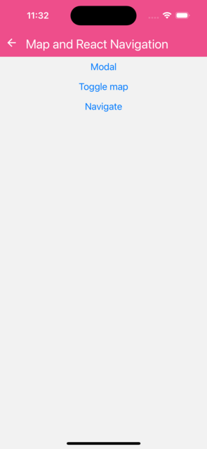

Demonstrates various ways to embedd map via (Navigation, Page, modal, etc)


```jsx
import React, { useState } from 'react';
import { Button, Modal, Text, SafeAreaView } from 'react-native';
import { MapView, UserLocation, Camera } from '@rnmapbox/maps';

/**
 * @param {ItempProps['navigation']} navigation
 */
export default function MapAndNavigation({ navigation }) {
  const [modalVisible, setModalVisible] = useState(false);
  const [showMap, setShowMap] = useState(false);

  return (
    <>
      <Button title="Modal" onPress={() => setModalVisible(true)} />
      <Button
        title="Toggle map"
        onPress={() => setShowMap((showMap) => !showMap)}
      />
      <Button
        title="Navigate"
        onPress={() => navigation.navigate('ScreenWithoutMap')}
      />
      <Modal
        animationType="slide"
        transparent={false}
        visible={modalVisible}
        onRequestClose={() => {
          setModalVisible(false);
        }}
      >
        <SafeAreaView style={{ flex: 1 }}>
          <Text>this is a modal</Text>
          <Button
            title="close"
            onPress={() => {
              setModalVisible(false);
            }}
          />
          <MapView style={{ flex: 1 }} />
        </SafeAreaView>
      </Modal>
      {showMap && (
        <MapView style={{ flex: 1 }}>
          <Camera
            centerCoordinate={[-74.00597, 40.71427]}
            zoomLevel={14}
            followUserLocation
            followZoomLevel={14}
          />
          <UserLocation
            androidRenderMode={'gps'}
            showsUserHeadingIndicator={true}
            renderMode={'native'}
          />
        </MapView>
      )}
    </>
  );
}


```

}

