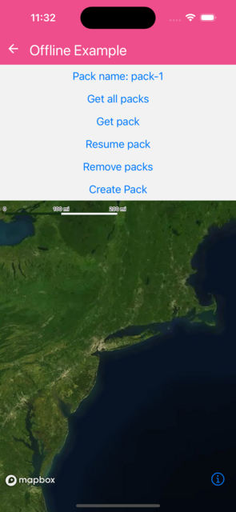

Demonstates basic use of offlineManager api.


```jsx
import geoViewport from '@mapbox/geo-viewport';
import Mapbox, {
  Camera,
  MapView,
  offlineManager,
  StyleURL,
} from '@rnmapbox/maps';
import React, { useState } from 'react';
import { Button, Dimensions, TextInput } from 'react-native';

import { ExampleWithMetadata } from '../common/ExampleMetadata'; // exclude-from-doc

const CENTER_COORD: [number, number] = [-73.970895, 40.723279];
const MAPBOX_VECTOR_TILE_SIZE = 512;
console.log('=> Mapbox[0]:', Mapbox);
console.log('=> Mapbox.StyleURL[1]:', Mapbox.StyleURL);
console.log('=> StyleURL[2]:', StyleURL);
const STYLE_URL = Mapbox.StyleURL.Satellite;

const OfflineExample = () => {
  const [packName, setPackName] = useState('pack-1');
  const [showEditTitle, setShowEditTitle] = useState(false);

  return (
    <>
      <Button
        title={`Pack name: ${packName}`}
        onPress={() => {
          setShowEditTitle(!showEditTitle);
        }}
      />
      {showEditTitle && (
        <TextInput
          value={packName}
          autoFocus={true}
          onChangeText={(text) => setPackName(text)}
          onBlur={() => setShowEditTitle(false)}
        />
      )}
      <Button
        title="Get all packs"
        onPress={async () => {
          const packs = await offlineManager.getPacks();
          console.log('=> packs:', packs);
          packs.forEach((pack) => {
            console.log(
              'pack:',
              pack,
              'name:',
              pack.name,
              'bounds:',
              pack?.bounds,
              'metadata',
              pack?.metadata,
            );
          });
        }}
      />
      <Button
        title="Get pack"
        onPress={async () => {
          const pack = await offlineManager.getPack(packName);
          if (pack) {
            console.log(
              'pack:',
              pack,
              'name:',
              pack.name,
              'bounds:',
              pack?.bounds,
              'metadata',
              pack?.metadata,
            );

            console.log('=> status', await pack?.status());
          }
        }}
      />
      <Button
        title="Resume pack"
        onPress={async () => {
          const pack = await offlineManager.getPack(packName);
          if (pack) {
            await pack.resume();
          }
        }}
      />
      <Button
        title="Remove packs"
        onPress={async () => {
          const result = await offlineManager.resetDatabase();
          console.log('Reset DB done:', result);
        }}
      />
      <Button
        title="Create Pack"
        onPress={() => {
          const { width, height } = Dimensions.get('window');
          const bounds: [number, number, number, number] = geoViewport.bounds(
            CENTER_COORD,
            12,
            [width, height],
            MAPBOX_VECTOR_TILE_SIZE,
          );

          const options = {
            name: packName,
            styleURL: STYLE_URL,
            bounds: [
              [bounds[0], bounds[1]],
              [bounds[2], bounds[3]],
            ] as [[number, number], [number, number]],
            minZoom: 10,
            maxZoom: 20,
            metadata: {
              whatIsThat: 'foo',
            },
          };
          offlineManager.createPack(options, (region, status) =>
            console.log('=> progress callback region:', 'status: ', status),
          );
        }}
      />
      <MapView style={{ flex: 1 }} styleURL={STYLE_URL}>
        <Camera zoomLevel={10} centerCoordinate={CENTER_COORD} />
      </MapView>
    </>
  );
};

export default OfflineExample;


```

}

