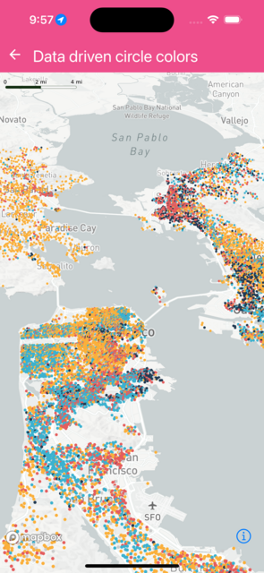

Renders circles with radius and color based on data-driven expressions.

Color is based on the `ethnicity` property of the feature, radius is based on zoom level.


```jsx
import React from 'react';
import Mapbox from '@rnmapbox/maps';

const styles = {
  circles: {
    circleRadius: [
      'interpolate',
      ['exponential', 1.75],
      ['zoom'],
      12,
      2,
      22,
      180,
    ],

    circleColor: [
      'match',
      ['get', 'ethnicity'],
      'White',
      '#fbb03b',
      'Black',
      '#223b53',
      'Hispanic',
      '#e55e5e',
      'Asian',
      '#3bb2d0',
      /* other */ '#ccc',
    ],
  },
  matchParent: { flex: 1 },
};

class DataDrivenCircleColors extends React.PureComponent {
  render() {
    return (
      <>
        <Mapbox.MapView
          styleURL={Mapbox.StyleURL.Light}
          style={styles.matchParent}
        >
          <Mapbox.Camera
            defaultSettings={{
              centerCoordinate: [-122.400021, 37.789085],
              pitch: 45,
              zoomLevel: 10,
            }}
          />

          <Mapbox.VectorSource
            id="population"
            url={'mapbox://examples.8fgz4egr'}
          >
            <Mapbox.CircleLayer
              id="sf2010CircleFill"
              sourceLayerID="sf2010"
              style={styles.circles}
            />
          </Mapbox.VectorSource>
        </Mapbox.MapView>
      </>
    );
  }
}
export default DataDrivenCircleColors;


```

}

