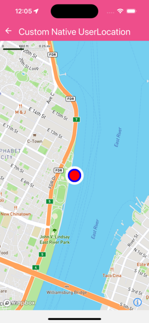

  Demonstrates use of images to customize LocationPuck
  

```jsx
import React from 'react';
import { SafeAreaView, View } from 'react-native';
import {
  MapView,
  Camera,
  UserTrackingMode,
  LocationPuck,
  Images,
  Image,
} from '@rnmapbox/maps';

import { ExampleWithMetadata } from '../common/ExampleMetadata';

const styles = { matchParent: { flex: 1 } };

const UserLocationNativeAnimated = () => {
  return (
    <SafeAreaView style={styles.matchParent}>
      <MapView style={styles.matchParent}>
        <Images>
          <Image name="topImage">
            <View
              style={{
                borderColor: 'blue',
                borderWidth: 2,
                width: 16,
                height: 16,
                borderRadius: 8,
                backgroundColor: 'red',
              }}
            />
          </Image>
        </Images>
        <Camera
          defaultSettings={{
            centerCoordinate: [-77.036086, 38.910233],
            zoomLevel: 14,
          }}
          followUserLocation={true}
          followUserMode={UserTrackingMode.Follow}
          followZoomLevel={14}
        />
        <LocationPuck
          topImage="topImage"
          visible={true}
          scale={['interpolate', ['linear'], ['zoom'], 10, 1.0, 20, 4.0]}
          pulsing={{
            isEnabled: true,
            color: 'teal',
            radius: 50.0,
          }}
        />
      </MapView>
    </SafeAreaView>
  );
};

export default UserLocationNativeAnimated;

const metadata: ExampleWithMetadata['metadata'] = {
  title: 'Custom Native UserLocation',
  tags: ['LocationPuck', 'LocationPuck#topImage', 'LocationPuck#scale'],
  docs: `
  Demonstrates use of images to customize LocationPuck
  `,
};
UserLocationNativeAnimated.metadata = metadata;

```

}

