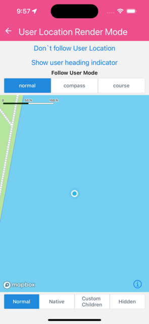

Demonstates UserLocation render modes, follow modes


```jsx
import React, { ReactNode, useState } from 'react';
import MapboxGL, {
  MapView,
  CircleLayer,
  UserLocation,
  Camera,
  UserLocationRenderMode as UserLocationRenderModeType,
  UserTrackingMode,
} from '@rnmapbox/maps';
import { Button, Platform, SafeAreaView, View } from 'react-native';
import { ButtonGroup, Text } from '@rneui/base';

import sheet from '../../styles/sheet';
import TabBarPage from '../common/TabBarPage';
import { BaseExampleProps } from '../common/BaseExamplePropTypes';
import { DEFAULT_CENTER_COORDINATE } from '../../utils';
import { ExampleWithMetadata } from '../common/ExampleMetadata'; // exclude-from-doc

const SettingsGroup = ({
  children,
  label,
}: {
  children: ReactNode;
  label: string;
}) => (
  <View>
    <Text style={{ textAlign: 'center', fontWeight: 'bold' }}>{label}</Text>
    {children}
  </View>
);

const styles = { matchParent: { flex: 1 } };

function humanize(name: string): string {
  const words = name.match(/[A-Za-z][a-z]*/g) || [];

  return words.map((i) => i.charAt(0).toUpperCase() + i.substring(1)).join(' ');
}

enum ExampleRenderMode {
  Normal = 'normal',
  Native = 'native',
  CustomChildren = 'customChildren',
  Hidden = 'hidden',
}

const ANDROID_RENDER_MODES: ('normal' | 'compass' | 'gps')[] = [
  'normal',
  'compass',
  'gps',
];

const UserLocationRenderMode = (props: BaseExampleProps) => {
  const [renderMode, setRenderMode] = useState<ExampleRenderMode>(
    ExampleRenderMode.Normal,
  );
  const [followUserLocation, setFollowUserLocation] = useState(true);
  const [followUserMode, setFollowUserMode] = useState(UserTrackingMode.Follow);
  const [showsUserHeadingIndicator, setShowsUserHeadingIndicator] =
    useState(false);
  const [androidRenderMode, setAndroidRenderMode] = useState<
    'normal' | 'compass' | 'gps'
  >('normal');

  return (
    <SafeAreaView style={styles.matchParent}>
      <View>
        <Button
          title={
            followUserLocation
              ? 'Don`t follow User Location'
              : 'Follow user location'
          }
          onPress={() => setFollowUserLocation((prevState) => !prevState)}
        />
        <Button
          title={
            showsUserHeadingIndicator
              ? 'Hide user heading indicator'
              : 'Show user heading indicator'
          }
          onPress={() =>
            setShowsUserHeadingIndicator((prevState) => !prevState)
          }
        />

        <SettingsGroup label="Follow User Mode">
          <ButtonGroup
            buttons={Object.values(UserTrackingMode)}
            selectedIndex={Object.values(UserTrackingMode).indexOf(
              followUserMode,
            )}
            onPress={(index) => {
              setFollowUserMode(Object.values(UserTrackingMode)[index]);
            }}
          />
        </SettingsGroup>

        {Platform.OS === 'android' && (
          <SettingsGroup label="Android Render Mode">
            <ButtonGroup
              disabled={renderMode !== ExampleRenderMode.Native}
              buttons={ANDROID_RENDER_MODES}
              selectedIndex={ANDROID_RENDER_MODES.indexOf(androidRenderMode)}
              onPress={(index) => {
                setAndroidRenderMode(ANDROID_RENDER_MODES[index]);
              }}
            />
          </SettingsGroup>
        )}
      </View>

      <MapView style={styles.matchParent} tintColor={'red'}>
        <Camera
          defaultSettings={{
            centerCoordinate: DEFAULT_CENTER_COORDINATE,
            zoomLevel: 18,
          }}
          followUserLocation={followUserLocation}
          followUserMode={followUserMode}
          followZoomLevel={18}
          onUserTrackingModeChange={(event) => {
            if (!event.nativeEvent.payload.followUserLocation) {
              setFollowUserLocation(false);
            }
          }}
        />
        <UserLocation
          visible={renderMode !== ExampleRenderMode.Hidden}
          renderMode={
            renderMode === ExampleRenderMode.Native
              ? UserLocationRenderModeType.Native
              : UserLocationRenderModeType.Normal
          }
          showsUserHeadingIndicator={showsUserHeadingIndicator}
          androidRenderMode={androidRenderMode}
        >
          {renderMode === ExampleRenderMode.CustomChildren
            ? [
                <CircleLayer
                  key="customer-user-location-children-red"
                  id="customer-user-location-children-red"
                  style={{ circleColor: 'red', circleRadius: 8 }}
                />,
                <CircleLayer
                  key="customer-user-location-children-white"
                  id="customer-user-location-children-white"
                  style={{ circleColor: 'white', circleRadius: 4 }}
                />,
              ]
            : undefined}
        </UserLocation>
      </MapView>
      <ButtonGroup
        buttons={Object.values(ExampleRenderMode).map(humanize)}
        selectedIndex={Object.values(ExampleRenderMode).indexOf(renderMode)}
        onPress={(index) => {
          setRenderMode(Object.values(ExampleRenderMode)[index]);
        }}
      />
    </SafeAreaView>
  );
};

export default UserLocationRenderMode;


```

}

